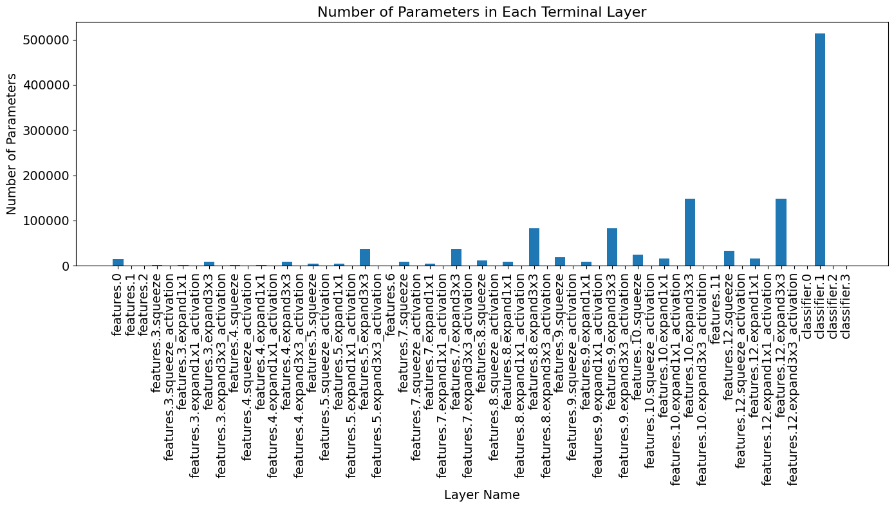

# Model Debugging, Inspection, and Modularization

So far, you've focused on building and training models. 
But in the real world, your first attempt at a model rarely works perfectly. 
You'll often encounter cryptic error messages about mismatched tensor shapes, or worse, your model will run without errors but fail to produce meaningful results. 

This is where **debugging, inspection, and modularization** become essential skills. 
In this lab, you'll step into the role of a model investigator. 
You'll start with a broken Convolutional Neural Network (CNN) and use systematic debugging techniques to find and fix the bug. Then, you'll learn how to refactor your code for clarity and reuse, and finally, you'll dissect a complex, pre-trained model to understand its inner workings.

In this lab, you will:

* **Debug** a broken CNN by inserting print statements into the `forward` pass to identify and correct a critical tensor shape mismatch.
* **Refactor** the corrected model using `nn.Sequential` to create a cleaner, more modular, and less error-prone architecture.
* **Inspect** the activation statistics of your model to perform a sanity check for issues like exploding or vanishing gradients.
* **Explore** the architecture of a complex, pre-existing model (`SqueezeNet`) to count its layers and analyze its parameter distribution.

## Imports


```python
import torch
import torch.nn as nn
import torchvision.transforms as transforms
from torch.utils.data import DataLoader
from torchvision.models import SqueezeNet
```


```python
import helper_utils
```

## Data Loading

To debug and inspect a model effectively, you'll first need a dataset to work with.
The goal of this lab is to practice an end-to-end debugging and inspection workflow, so you'll use a simple dataset that lets you focus on the model architecture rather than complex data preprocessing.
For this purpose, you'll use the Fashion MNIST dataset, which consists of grayscale images of clothing items and serves as a straightforward benchmark for image classification tasks.
You’ll begin by loading the dataset using PyTorch’s torchvision library, and then create a DataLoader to efficiently handle the data in batches during training and evaluation.


```python
dataset = helper_utils.get_dataset()

transform = transforms.ToTensor()
dataset.transform = transform
```

    Dataset already exists.


```python
batch_size = 64
dataloader = DataLoader(dataset, batch_size=batch_size, shuffle=False)
```


```python
img_batch, label_batch = next(iter(dataloader))
print("Batch shape:", img_batch.shape)  # Should be [batch_size, 1, 28, 28]
```

    Batch shape: torch.Size([64, 1, 28, 28])


## Debugging through forward pass

When starting to work with a new model, it is common to encounter errors. 
These errors can be due to various reasons, such as incorrect tensor shapes, incompatible operations, or unexpected values.
Sometimes, the model may run without errors but produce incorrect outputs.

In this section, you will explore how to debug a PyTorch model by examining its forward pass.

### A first exploration of the model

It is now time to explore the model.
This model is a simple network with:
* a convolutional block: consisting of a convolutional layer, a ReLU activation function, and a max pooling layer,
* a fully connected block: consisting of a linear layer, a ReLU activation function, and a final linear layer that outputs the class scores.

You will first instantiate the model and try to run a forward pass with a batch from the dataloader.
To get a cleaner output in case of errors, you will use `try/except` to catch any exceptions that may arise during the forward pass.


```python
class SimpleCNN(nn.Module):
    def __init__(self):
        super().__init__()
        # Convolutional Block
        self.conv = nn.Conv2d(in_channels=1, out_channels=32, kernel_size=3, padding=1)
        self.relu = nn.ReLU()
        self.pool = nn.MaxPool2d(kernel_size=2, stride=2)

        # Fully Connected Block
        # For Fashion MNIST: input images are 28x28,
        # after conv+pool: 32x14x14
        self.fc1 = nn.Linear(32 * 14 * 14, 128)
        self.relu_fc = nn.ReLU()
        self.fc2 = nn.Linear(128, 10)  # 10 classes for Fashion MNIST

    def forward(self, x):
        x = self.pool(self.relu(self.conv(x)))
        x = self.relu_fc(self.fc1(x))
        x = self.fc2(x)
        return x
```


```python
simple_cnn = SimpleCNN()

try:
    output = simple_cnn(img_batch)  
except Exception as e:
    print(f"\033[91mError during forward pass: {e}\033[0m")
```

    Error during forward pass: mat1 and mat2 shapes cannot be multiplied (28672x14 and 6272x128)


Indeed, the model as provided contains some errors that require debugging.
The message provided by PyTorch when an error occurs can sometimes be cryptic.
It describes that two matrices (`mat1` and `mat2`) cannot be multiplied and provides their shapes.
This indicates that there is a mismatch in the dimensions of the tensors being multiplied, which is a common issue in neural network implementations.

However, the error message does not specify **why and where** in the model the error occurs.
That is when the `forward` method of the model comes into play.
The dynamic graph nature of PyTorch allows you to insert print statements or use debugging tools to inspect the values and shapes of tensors at various points in the `forward` method.

You will define a new class that inherits from the original model and overrides the `forward` method to include print statements that display the shape of the tensor after each layer.
A first try might be to explicitly separate the layers in the `forward` method and, for each layer:
* print the shape of the tensor before the layer (input shape),
* print the shape of some *parameters of the layer* (e.g., weights and biases),
* print the shape of the *activation* tensor after the layer (output shape), which will be the input for the next layer.

You can now run the forward pass again and observe the printed shapes to identify where the mismatch occurs.


```python
class SimpleCNNDebug(SimpleCNN):
    def __init__(self):
        super().__init__()
        # The super().__init__() call above properly initializes all layers from SimpleCNN
        # No need to redefine the layers here

    def forward(self, x):
        print("Input shape:", x.shape)
        print(
            " (Layer components) Conv layer parameters (weights, biases):",
            self.conv.weight.shape,
            self.conv.bias.shape,
        )
        x_conv = self.relu(self.conv(x))

        print("===")

        print("(Activation) After convolution and ReLU:", x_conv.shape)
        x_pool = self.pool(x_conv)
        print("(Activation) After pooling:", x_pool.shape)

        print(
            "(Layer components) Linear layer fc1 parameters (weights, biases):",
            self.fc1.weight.shape,
            self.fc1.bias.shape,
        )

        x_fc1 = self.relu_fc(self.fc1(x_pool))

        print("===")

        print("(Activation) After fc1 and ReLU:", x_fc1.shape)

        print(
            "(Layer components) Linear layer fc2 parameters (weights, biases):",
            self.fc2.weight.shape,
            self.fc2.bias.shape,
        )
        x = self.fc2(x_fc1)

        print("===")

        print("(Activation) After fc2 (output):", x.shape)
        return x
```


```python
simple_cnn_debug = SimpleCNNDebug()

try:
    output_debug = simple_cnn_debug(img_batch)  
except Exception as e:
    print(f"\033[91mError during forward pass in debug model: {e}\033[0m")
```

    Input shape: torch.Size([64, 1, 28, 28])
     (Layer components) Conv layer parameters (weights, biases): torch.Size([32, 1, 3, 3]) torch.Size([32])
    ===
    (Activation) After convolution and ReLU: torch.Size([64, 32, 28, 28])
    (Activation) After pooling: torch.Size([64, 32, 14, 14])
    (Layer components) Linear layer fc1 parameters (weights, biases): torch.Size([128, 6272]) torch.Size([128])
    Error during forward pass in debug model: mat1 and mat2 shapes cannot be multiplied (28672x14 and 6272x128)


This is already a cleaner output. You can already see that all the layers of the convolutional block are working fine, and the shapes are as expected (`batch_size=64` and `out_channels=32`).

**The error occurs in the fully connected block**, specifically at the first linear layer: `x_pool` has shape `[64, 32, 14, 14]`, but the linear layer expects an input of shape `[64, 6272]` (its weight matrix has shape `[128, 6272]`).

As the linear layer `fc1` expects a 2D input of shape `[batch_size, input_features]`, the `x_pool` is flattened to a 2D tensor with shape `[64*32*14, 14]` before being passed to `fc1`. This is not the intended shape, and it leads to the dimension mismatch error.

Once you have identified the issue, you can fix it by adding a flattening operation before the first linear layer in the `forward` method.


```python
class SimpleCNNFixed(SimpleCNN):
    def __init__(self):
        super().__init__()

    def forward(self, x):
        print("Input shape:", x.shape)
        print(
            " (Neuron components) Conv layer parameters (weights, biases):",
            self.conv.weight.shape,
            self.conv.bias.shape,
        )
        x_conv = self.relu(self.conv(x))

        print("===")

        print("(Activation) After convolution and ReLU:", x_conv.shape)
        x_pool = self.pool(x_conv)
        print("(Activation) After pooling:", x_pool.shape)

        x_flattened = torch.flatten(
            x_pool, start_dim=1
        )  # Flatten all dimensions except batch
        print("(Activation) After flattening:", x_flattened.shape)

        print(
            "(Neuron components) Linear layer fc1 parameters (weights, biases):",
            self.fc1.weight.shape,
            self.fc1.bias.shape,
        )

        x_fc1 = self.relu_fc(self.fc1(x_flattened))

        print("===")

        print("(Activation) After fc1 and ReLU:", x_fc1.shape)

        print(
            "(Neuron components) Linear layer fc2 parameters (weights, biases):",
            self.fc2.weight.shape,
            self.fc2.bias.shape,
        )
        x = self.fc2(x_fc1)

        print("===")

        print("(Activation) After fc2 (output):", x.shape)
        return x
```


```python
# Fixed version
simple_cnn_fixed = SimpleCNNFixed()

output = simple_cnn_fixed(img_batch)
```

    Input shape: torch.Size([64, 1, 28, 28])
     (Neuron components) Conv layer parameters (weights, biases): torch.Size([32, 1, 3, 3]) torch.Size([32])
    ===
    (Activation) After convolution and ReLU: torch.Size([64, 32, 28, 28])
    (Activation) After pooling: torch.Size([64, 32, 14, 14])
    (Activation) After flattening: torch.Size([64, 6272])
    (Neuron components) Linear layer fc1 parameters (weights, biases): torch.Size([128, 6272]) torch.Size([128])
    ===
    (Activation) After fc1 and ReLU: torch.Size([64, 128])
    (Neuron components) Linear layer fc2 parameters (weights, biases): torch.Size([10, 128]) torch.Size([10])
    ===
    (Activation) After fc2 (output): torch.Size([64, 10])


The issue is now fixed, and the model runs without errors! You can see that the shapes of the tensors are as expected after each layer, and the final output has the correct shape of `[64, 10]`, corresponding to the batch size and the number of classes.

Once the model is running without errors, you can jump the next section to refactor the model using `nn.Sequential` for a cleaner and more modular implementation.

## `nn.Sequential` for Modularization

The model is now working correctly, but the `forward` method is quite verbose and repetitive.
To make the code cleaner and more modular, you can use `nn.Sequential` to define the convolutional and fully connected blocks.

In this way you gain several advantages:
* **Modularity**: Each block is defined as a separate module, making it easier to understand and modify.
* **Reusability**: You can easily reuse the blocks in other models or experiments.
* **Cleaner Code**: The `forward` method becomes much simpler, as it only needs to call the blocks sequentially.
* **Less Error-Prone**: By defining the blocks in one place, you reduce the chances of making mistakes when implementing the `forward` method.


```python
class SimpleCNN2Seq(nn.Module):
    def __init__(self):
        super().__init__()
        # Convolutional Block
        self.conv_block = nn.Sequential(
            nn.Conv2d(in_channels=1, out_channels=32, kernel_size=3, padding=1),
            nn.ReLU(),
            nn.MaxPool2d(kernel_size=2, stride=2),
        )

        # Fully Connected Block
        # For Fashion MNIST: input images are 28x28,
        # after conv+pool: 32x14x14
        flattened_size = 32 * 14 * 14
        self.fc_block = nn.Sequential(
            nn.Linear(flattened_size, 128),
            nn.ReLU(),
            nn.Linear(128, 10),  # 10 classes for Fashion MNIST
        )

    def forward(self, x):
        x = self.conv_block(x)
        x = torch.flatten(x, start_dim=1)  # Flatten all dimensions except batch
        x = self.fc_block(x)
        return x
```


```python
simple_cnn_seq = SimpleCNN2Seq()
output = simple_cnn_seq(img_batch)

print("Output shape from sequential model:", output.shape)
```

    Output shape from sequential model: torch.Size([64, 10])


### Statistical Inspection of the Initialization

A common check when inspecting a model is to look at the statistics of some activations to ensure that they are within a reasonable range.


```python
class SimpleCNN2SeqDebug(SimpleCNN2Seq):
    def __init__(self):
        super().__init__()
        # The super().__init__() call above properly initializes all layers from SimpleCNN2Seq
        # No need to redefine the layers here

    def get_statistics(self, activation):
        mean = activation.mean().item()
        std = activation.std().item()
        min_val = activation.min().item()
        max_val = activation.max().item()

        print(f" Mean: {mean}")
        print(f" Std: {std}")
        print(f" Min: {min_val}")
        print(f" Max: {max_val}")
        return mean, std, min_val, max_val

    def forward(self, x):
        features = self.conv_block(x)
        x = torch.flatten(features, start_dim=1)  # Flatten all dimensions except batch

        print("After conv_block, the activation statistics are:")
        self.get_statistics(features)

        x = self.fc_block(x)
        print("After fc_block, the activation statistics are:")
        self.get_statistics(x)
        return x
```


```python
simple_cnn_seq_debug = SimpleCNN2SeqDebug()

for idx, (img_batch, _) in enumerate(dataloader):
    if idx < 5:
        print(f"=== Batch {idx} ===")
        output_debug = simple_cnn_seq_debug(img_batch)
```

    === Batch 0 ===
    After conv_block, the activation statistics are:
     Mean: 0.12057128548622131
     Std: 0.19217714667320251
     Min: 0.0
     Max: 1.4452306032180786
    After fc_block, the activation statistics are:
     Mean: 0.002593749202787876
     Std: 0.10338133573532104
     Min: -0.24008816480636597
     Max: 0.2974345088005066
    === Batch 1 ===
    After conv_block, the activation statistics are:
     Mean: 0.12372037023305893
     Std: 0.19829188287258148
     Min: 0.0
     Max: 1.4379286766052246
    After fc_block, the activation statistics are:
     Mean: 0.004585432354360819
     Std: 0.1048705205321312
     Min: -0.23610897362232208
     Max: 0.3003295361995697
    === Batch 2 ===
    After conv_block, the activation statistics are:
     Mean: 0.12330515682697296
     Std: 0.19771307706832886
     Min: 0.0
     Max: 1.4355064630508423
    After fc_block, the activation statistics are:
     Mean: 0.0033026307355612516
     Std: 0.10424826294183731
     Min: -0.2499183863401413
     Max: 0.29883137345314026
    === Batch 3 ===
    After conv_block, the activation statistics are:
     Mean: 0.12178877741098404
     Std: 0.19401170313358307
     Min: 0.0
     Max: 1.4008527994155884
    After fc_block, the activation statistics are:
     Mean: 0.003290188265964389
     Std: 0.10326161235570908
     Min: -0.2500610649585724
     Max: 0.2814618945121765
    === Batch 4 ===
    After conv_block, the activation statistics are:
     Mean: 0.12229796499013901
     Std: 0.195134237408638
     Min: 0.0
     Max: 1.457446813583374
    After fc_block, the activation statistics are:
     Mean: 0.003410323755815625
     Std: 0.1030023917555809
     Min: -0.2398100197315216
     Max: 0.2848304510116577


This is a sanity check to ensure that the model is initialized correctly and that the activations are not exploding or vanishing.
*Those issues can lead to poor training performance or convergence problems.*

## Model Inspection

With the previous model working correctly, you will now inspect a pre-existing complex model from `torchvision.models`, such as `SqueezeNet`.

In this section you will make use of the inspection utilities provided by PyTorch to explore the model's architecture, layers, and parameters.
These inspection techniques are foundational for effective debugging and for making informed modifications to your neural network designs.

### Architecture Overview


```python
# Load SqueezeNet model
complex_model = SqueezeNet()

print(complex_model)
```

    SqueezeNet(
      (features): Sequential(
        (0): Conv2d(3, 96, kernel_size=(7, 7), stride=(2, 2))
        (1): ReLU(inplace=True)
        (2): MaxPool2d(kernel_size=3, stride=2, padding=0, dilation=1, ceil_mode=True)
        (3): Fire(
          (squeeze): Conv2d(96, 16, kernel_size=(1, 1), stride=(1, 1))
          (squeeze_activation): ReLU(inplace=True)
          (expand1x1): Conv2d(16, 64, kernel_size=(1, 1), stride=(1, 1))
          (expand1x1_activation): ReLU(inplace=True)
          (expand3x3): Conv2d(16, 64, kernel_size=(3, 3), stride=(1, 1), padding=(1, 1))
          (expand3x3_activation): ReLU(inplace=True)
        )
        (4): Fire(
          (squeeze): Conv2d(128, 16, kernel_size=(1, 1), stride=(1, 1))
          (squeeze_activation): ReLU(inplace=True)
          (expand1x1): Conv2d(16, 64, kernel_size=(1, 1), stride=(1, 1))
          (expand1x1_activation): ReLU(inplace=True)
          (expand3x3): Conv2d(16, 64, kernel_size=(3, 3), stride=(1, 1), padding=(1, 1))
          (expand3x3_activation): ReLU(inplace=True)
        )
        (5): Fire(
          (squeeze): Conv2d(128, 32, kernel_size=(1, 1), stride=(1, 1))
          (squeeze_activation): ReLU(inplace=True)
          (expand1x1): Conv2d(32, 128, kernel_size=(1, 1), stride=(1, 1))
          (expand1x1_activation): ReLU(inplace=True)
          (expand3x3): Conv2d(32, 128, kernel_size=(3, 3), stride=(1, 1), padding=(1, 1))
          (expand3x3_activation): ReLU(inplace=True)
        )
        (6): MaxPool2d(kernel_size=3, stride=2, padding=0, dilation=1, ceil_mode=True)
        (7): Fire(
          (squeeze): Conv2d(256, 32, kernel_size=(1, 1), stride=(1, 1))
          (squeeze_activation): ReLU(inplace=True)
          (expand1x1): Conv2d(32, 128, kernel_size=(1, 1), stride=(1, 1))
          (expand1x1_activation): ReLU(inplace=True)
          (expand3x3): Conv2d(32, 128, kernel_size=(3, 3), stride=(1, 1), padding=(1, 1))
          (expand3x3_activation): ReLU(inplace=True)
        )
        (8): Fire(
          (squeeze): Conv2d(256, 48, kernel_size=(1, 1), stride=(1, 1))
          (squeeze_activation): ReLU(inplace=True)
          (expand1x1): Conv2d(48, 192, kernel_size=(1, 1), stride=(1, 1))
          (expand1x1_activation): ReLU(inplace=True)
          (expand3x3): Conv2d(48, 192, kernel_size=(3, 3), stride=(1, 1), padding=(1, 1))
          (expand3x3_activation): ReLU(inplace=True)
        )
        (9): Fire(
          (squeeze): Conv2d(384, 48, kernel_size=(1, 1), stride=(1, 1))
          (squeeze_activation): ReLU(inplace=True)
          (expand1x1): Conv2d(48, 192, kernel_size=(1, 1), stride=(1, 1))
          (expand1x1_activation): ReLU(inplace=True)
          (expand3x3): Conv2d(48, 192, kernel_size=(3, 3), stride=(1, 1), padding=(1, 1))
          (expand3x3_activation): ReLU(inplace=True)
        )
        (10): Fire(
          (squeeze): Conv2d(384, 64, kernel_size=(1, 1), stride=(1, 1))
          (squeeze_activation): ReLU(inplace=True)
          (expand1x1): Conv2d(64, 256, kernel_size=(1, 1), stride=(1, 1))
          (expand1x1_activation): ReLU(inplace=True)
          (expand3x3): Conv2d(64, 256, kernel_size=(3, 3), stride=(1, 1), padding=(1, 1))
          (expand3x3_activation): ReLU(inplace=True)
        )
        (11): MaxPool2d(kernel_size=3, stride=2, padding=0, dilation=1, ceil_mode=True)
        (12): Fire(
          (squeeze): Conv2d(512, 64, kernel_size=(1, 1), stride=(1, 1))
          (squeeze_activation): ReLU(inplace=True)
          (expand1x1): Conv2d(64, 256, kernel_size=(1, 1), stride=(1, 1))
          (expand1x1_activation): ReLU(inplace=True)
          (expand3x3): Conv2d(64, 256, kernel_size=(3, 3), stride=(1, 1), padding=(1, 1))
          (expand3x3_activation): ReLU(inplace=True)
        )
      )
      (classifier): Sequential(
        (0): Dropout(p=0.5, inplace=False)
        (1): Conv2d(512, 1000, kernel_size=(1, 1), stride=(1, 1))
        (2): ReLU(inplace=True)
        (3): AdaptiveAvgPool2d(output_size=(1, 1))
      )
    )


For complex models, printing the entire model architecture can be overwhelming.
Instead, you can make use of `named_children()` and `children()` to iterate through the top-level blocks of the model.


```python
# Iterate through the main blocks
for name, block in complex_model.named_children():
    print(f"Block {name} has a total of {len(list(block.children()))} layers:")
    
    # List all children layers in the block
    for idx, layer in enumerate(block.children()):
        # Check if the layer is terminal (no children) or not
        if len(list(layer.children())) == 0:
            print(f"\t {idx} - Layer {layer}")
        # If the layer has children, it's a sub-block, then print only the number of children and its name
        else:
            layer_name = layer._get_name()  # More user-friendly name
            print(f"\t {idx} - Sub-block {layer_name} with {len(list(layer.children()))} layers")            
```

    Block features has a total of 13 layers:
    	 0 - Layer Conv2d(3, 96, kernel_size=(7, 7), stride=(2, 2))
    	 1 - Layer ReLU(inplace=True)
    	 2 - Layer MaxPool2d(kernel_size=3, stride=2, padding=0, dilation=1, ceil_mode=True)
    	 3 - Sub-block Fire with 6 layers
    	 4 - Sub-block Fire with 6 layers
    	 5 - Sub-block Fire with 6 layers
    	 6 - Layer MaxPool2d(kernel_size=3, stride=2, padding=0, dilation=1, ceil_mode=True)
    	 7 - Sub-block Fire with 6 layers
    	 8 - Sub-block Fire with 6 layers
    	 9 - Sub-block Fire with 6 layers
    	 10 - Sub-block Fire with 6 layers
    	 11 - Layer MaxPool2d(kernel_size=3, stride=2, padding=0, dilation=1, ceil_mode=True)
    	 12 - Sub-block Fire with 6 layers
    Block classifier has a total of 4 layers:
    	 0 - Layer Dropout(p=0.5, inplace=False)
    	 1 - Layer Conv2d(512, 1000, kernel_size=(1, 1), stride=(1, 1))
    	 2 - Layer ReLU(inplace=True)
    	 3 - Layer AdaptiveAvgPool2d(output_size=(1, 1))


This provides a cleaner overview of the model's structure, allowing you to focus on the main components without getting lost in the details of every single layer.
You will now zoom into one of the `Fire` modules to see its internal structure.

For that you can use `modules()` to iterate through all the layers and sub-modules of the model.


```python
first_fire_module = complex_model.features[3]

for idx, module in enumerate(first_fire_module.modules()):
    # Avoid printing the top-level module itself
    if idx > 0 :
        print(module)
```

    Conv2d(96, 16, kernel_size=(1, 1), stride=(1, 1))
    ReLU(inplace=True)
    Conv2d(16, 64, kernel_size=(1, 1), stride=(1, 1))
    ReLU(inplace=True)
    Conv2d(16, 64, kernel_size=(3, 3), stride=(1, 1), padding=(1, 1))
    ReLU(inplace=True)


Now the model's architecture is neatly printed, showing the main components and their configurations.
You can now do some specific inspections such as counting the number of specific layer types or calculating the total number of parameters in the model.

### Detail Inspection

You will now count how many `Conv2d` layers are in the model.


```python
type_layer = nn.Conv2d

selected_layers = [layer for layer in complex_model.modules() if isinstance(layer, type_layer)]

print(f"Number of {type_layer.__name__} layers: {len(selected_layers)}")
```

    Number of Conv2d layers: 26


You will now count the total number of parameters in the model.
This gives you an idea of the model's complexity and capacity.


```python
# total number of parameters in the model
total_params = sum(p.numel() for p in complex_model.parameters())
print(f"Total number of parameters in the model: {total_params}")
```

    Total number of parameters in the model: 1248424


Now, you can take this further by inspecting the parameters of each terminal layer (layers without children) in the model.
For each terminal layer, you will print its name and the total number of parameters it contains.
This helps to identify which layers contribute most to the model's parameter count and can be useful for model optimization, pruning, or understanding where the model's capacity lies.


```python
counting_params = {}

# For each terminal layer print its number of parameters
for layer in complex_model.named_modules():
    n_children = len(list(layer[1].children()))
    if n_children == 0:  # Terminal layer
        layer_name = layer[0]
        n_parameters = sum(p.numel() for p in layer[1].parameters())
        counting_params[layer_name] = n_parameters
        print(f"Layer {layer_name} has {n_parameters} parameters")

# Plotting the distribution of parameters per layer
helper_utils.plot_counting(counting_params)
```

    Layer features.0 has 14208 parameters
    Layer features.1 has 0 parameters
    Layer features.2 has 0 parameters
    Layer features.3.squeeze has 1552 parameters
    Layer features.3.squeeze_activation has 0 parameters
    Layer features.3.expand1x1 has 1088 parameters
    Layer features.3.expand1x1_activation has 0 parameters
    Layer features.3.expand3x3 has 9280 parameters
    Layer features.3.expand3x3_activation has 0 parameters
    Layer features.4.squeeze has 2064 parameters
    Layer features.4.squeeze_activation has 0 parameters
    Layer features.4.expand1x1 has 1088 parameters
    Layer features.4.expand1x1_activation has 0 parameters
    Layer features.4.expand3x3 has 9280 parameters
    Layer features.4.expand3x3_activation has 0 parameters
    Layer features.5.squeeze has 4128 parameters
    Layer features.5.squeeze_activation has 0 parameters
    Layer features.5.expand1x1 has 4224 parameters
    Layer features.5.expand1x1_activation has 0 parameters
    Layer features.5.expand3x3 has 36992 parameters
    Layer features.5.expand3x3_activation has 0 parameters
    Layer features.6 has 0 parameters
    Layer features.7.squeeze has 8224 parameters
    Layer features.7.squeeze_activation has 0 parameters
    Layer features.7.expand1x1 has 4224 parameters
    Layer features.7.expand1x1_activation has 0 parameters
    Layer features.7.expand3x3 has 36992 parameters
    Layer features.7.expand3x3_activation has 0 parameters
    Layer features.8.squeeze has 12336 parameters
    Layer features.8.squeeze_activation has 0 parameters
    Layer features.8.expand1x1 has 9408 parameters
    Layer features.8.expand1x1_activation has 0 parameters
    Layer features.8.expand3x3 has 83136 parameters
    Layer features.8.expand3x3_activation has 0 parameters
    Layer features.9.squeeze has 18480 parameters
    Layer features.9.squeeze_activation has 0 parameters
    Layer features.9.expand1x1 has 9408 parameters
    Layer features.9.expand1x1_activation has 0 parameters
    Layer features.9.expand3x3 has 83136 parameters
    Layer features.9.expand3x3_activation has 0 parameters
    Layer features.10.squeeze has 24640 parameters
    Layer features.10.squeeze_activation has 0 parameters
    Layer features.10.expand1x1 has 16640 parameters
    Layer features.10.expand1x1_activation has 0 parameters
    Layer features.10.expand3x3 has 147712 parameters
    Layer features.10.expand3x3_activation has 0 parameters
    Layer features.11 has 0 parameters
    Layer features.12.squeeze has 32832 parameters
    Layer features.12.squeeze_activation has 0 parameters
    Layer features.12.expand1x1 has 16640 parameters
    Layer features.12.expand1x1_activation has 0 parameters
    Layer features.12.expand3x3 has 147712 parameters
    Layer features.12.expand3x3_activation has 0 parameters
    Layer classifier.0 has 0 parameters
    Layer classifier.1 has 513000 parameters
    Layer classifier.2 has 0 parameters
    Layer classifier.3 has 0 parameters


    

    


# Conclusion

You have now successfully debugged, refactored, and inspected PyTorch models. 
In this lab, you saw firsthand that a model's `forward` pass is not a black box and that by strategically adding print statements, you can diagnose and solve common but frustrating errors like shape mismatches.

You have moved beyond simply writing model code and can now make it more robust and readable by grouping layers into logical blocks with **`nn.Sequential`**. 
This practice of modularization makes your architectures easier to understand, reuse, and adapt. 
You also learned how to perform essential sanity checks by inspecting activation statistics and how to systematically explore any PyTorch model, no matter how complex, using inspection utilities like `.modules()` and `.named_children()`.

With these fundamental skills of debugging and inspection, you are well-prepared for more advanced challenges.
